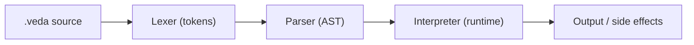

# Architecture

Veda Stage 0/1 is a classic interpreter pipeline:

## Layers

- `lexer.py`: turns text into tokens (keywords, identifiers, literals, operators)
- `parser.py`: recursive descent parser → AST nodes
- `interpreter.py`: executes AST with an `Environment` for scopes
- `checker.py`: learner-focused semantic checks used by `veda check`

## Philosophy

The goal is clarity first:

- No `eval()`/`exec()`
- Helpful errors with line/column pointers
- A path toward self-hosting (later)

